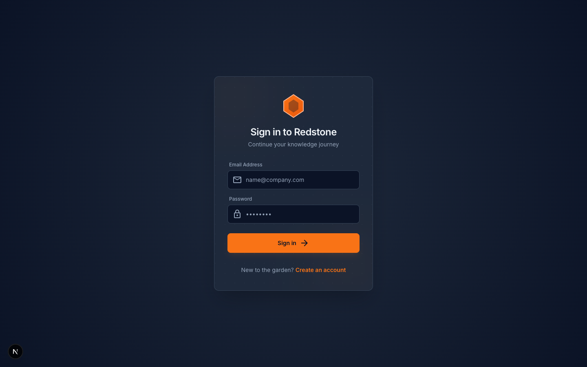
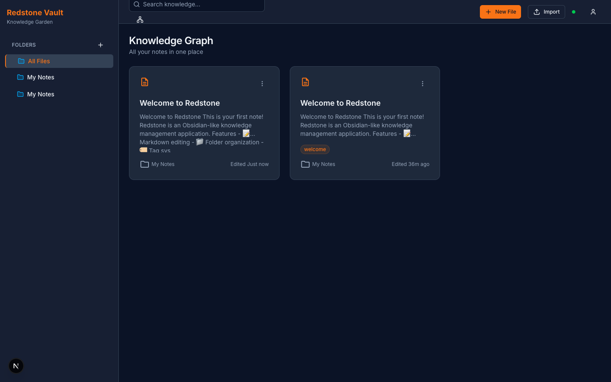
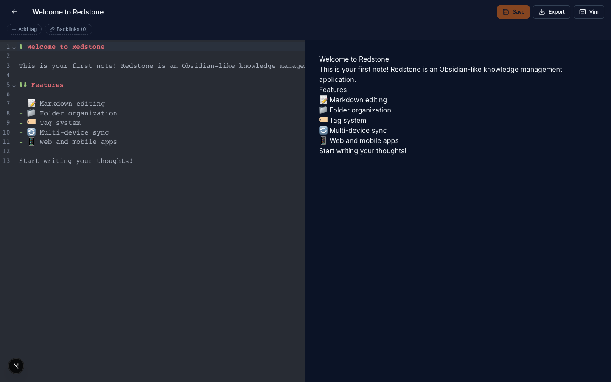
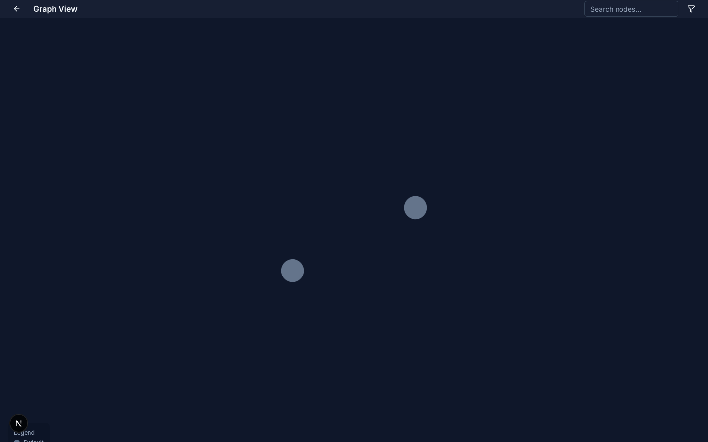

# Redstone

An Obsidian-like knowledge management application with markdown support, folder organization, wiki links, graph view, and multi-device sync.

The web app uses a **Redstone Vault** dark UI (navy background, orange accents) based on the [Stitch](https://stitch.withgoogle.com) design system. See [DESIGN.md](DESIGN.md) for tokens and screen specs.

## Screenshots

| Sign in | Dashboard |
| --- | --- |
|  |  |

| File editor | Graph view |
| --- | --- |
|  |  |

Regenerate locally (dev server must be running):

```bash
node scripts/capture-screenshots.mjs
```

Requires [Playwright](https://playwright.dev/) Chromium (`npx playwright install chromium`).

## Tech Stack

- **Monorepo**: pnpm workspaces + Turborepo
- **Web**: Next.js 16 (App Router), React, TypeScript, Tailwind CSS, shadcn/ui
- **Mobile**: Expo React Native with offline SQLite and incremental sync
- **Desktop**: Electron 43 with Node SQLite, encrypted auth, and Forge packaging
- **Database**: PostgreSQL 15+ with Prisma ORM
- **Authentication**: NextAuth.js (web) + JWT (mobile API)
- **CI**: GitHub Actions (lint, build, migrate, API tests)

## Project Structure

```
redstone/
├── apps/
│   ├── web/              # Next.js web application
│   ├── mobile/           # Expo offline-first mobile app
│   └── desktop/          # Electron offline-first desktop app
├── packages/
│   ├── shared/           # Shared TypeScript types and utilities
│   ├── database/         # Prisma schema and client
│   ├── api-client/       # Shared API client
│   └── markdown/         # Markdown utilities
├── docker/               # Docker Compose (PostgreSQL)
├── docs/screenshots/     # UI screenshots for README / PRs
├── scripts/              # Stitch export, screenshot capture
├── DESIGN.md             # Design tokens and screen inventory
├── DESIGN_PLAN.md        # Stitch prompts per screen
├── PLAN.md               # Development plan
├── COMPLETED.md          # Archived implementation notes
└── API.md                # API documentation
```

## Getting Started

### Prerequisites

- Node.js 18+
- pnpm 8+
- Docker & Docker Compose (for PostgreSQL)

### Installation

1. Clone the repository:

```bash
git clone https://github.com/dcoric/redstone.git
cd redstone
```

2. Install dependencies:

```bash
pnpm install
```

3. Start PostgreSQL:

```bash
cd docker && docker compose up -d
```

4. Set up environment variables:

```bash
cp .env.example apps/web/.env.local
# Edit apps/web/.env.local if needed (NEXTAUTH_SECRET, DATABASE_URL)
```

5. Run database migrations and seed:

```bash
pnpm --filter @redstone/database db:generate
pnpm --filter @redstone/database db:migrate
pnpm --filter @redstone/database db:seed
```

6. Start the development server:

```bash
pnpm dev:web
```

Open [http://localhost:3000](http://localhost:3000).

### Test credentials

After seeding:

- **Email**: `test@redstone.app`
- **Password**: `password123`

## Development Commands

```bash
# Run apps
pnpm dev              # All apps (turbo)
pnpm dev:web          # Next.js web app only
pnpm dev:mobile       # Expo mobile app
pnpm dev:desktop      # Electron desktop app
pnpm make:desktop     # Build installer for the current platform

# Database
pnpm --filter @redstone/database db:generate
pnpm --filter @redstone/database db:migrate
pnpm --filter @redstone/database db:seed
pnpm --filter @redstone/database db:studio

# Quality
pnpm build            # Build all packages
pnpm test             # Run tests (includes API route tests in apps/web)
pnpm lint             # ESLint across the monorepo
pnpm --filter mobile exec tsc --noEmit
```

## Features

### Core

- User registration and login (NextAuth on web, JWT for API/mobile clients)
- Markdown files with versioning and soft deletes
- Nested folders, tags, and full-text search
- Wiki-style `[[links]]`, backlinks, and broken-link detection
- Real-time updates via Server-Sent Events (SSE)
- Import / export (vault and single files)
- File attachments (API + database model)

### Web UI

- **Vault design**: sign-in/sign-up, sidebar, bento-style file cards, graph canvas
- Markdown editor with live preview and optional Vim keybindings
- Interactive force-directed **graph view** with tag/folder filters
- Folder tree with CRUD, inline rename, and context menus
- Tag management on the file editor
- Search with highlighting

### Mobile

- Persistent JWT authentication using SecureStore
- Offline-first file creation, editing, deletion, and markdown preview
- Incremental SQLite sync with explicit conflict resolution
- Folder navigation and file moves
- Local title/content search
- Offline tag add/remove and tag filtering

### Desktop

- Hardened Electron renderer with context isolation, sandboxing, and validated IPC
- JWT sessions encrypted with the operating system credential backend
- Persistent local SQLite vault with search and file CRUD
- Incremental synchronization and explicit conflict resolution
- Forge makers for macOS, Windows, and Linux
- Tag-triggered GitHub Release workflow

### In progress / planned

- **Mobile release candidate** — implementation complete; physical-device QA pending
- **Desktop release candidate** — local macOS package passes; tagged matrix release pending

See [PLAN.md](PLAN.md) for the full roadmap and [COMPLETED.md](COMPLETED.md) for shipped work.

## Design & Stitch

- [DESIGN.md](DESIGN.md) — colors, typography, components, screen list (for Stitch or other tools)
- [DESIGN_PLAN.md](DESIGN_PLAN.md) — per-screen Stitch prompts
- `scripts/fetch-stitch-project.mjs` — export screens from a Stitch project via `@google/stitch-sdk`

## API Documentation

See [API.md](API.md).

```bash
# JWT login (mobile / API clients)
curl -X POST http://localhost:3000/api/auth/login \
  -H "Content-Type: application/json" \
  -d '{"email":"test@redstone.app","password":"password123"}'
```

Web sessions use NextAuth cookies after signing in through the UI.

## Database

Key models: **User**, **File**, **Folder**, **FileVersion**, **Tag**, **FileTag**, **Attachment**.

Schema: [packages/database/prisma/schema.prisma](packages/database/prisma/schema.prisma)

## Project Status

| Phase | Status |
| --- | --- |
| 1 — Foundation | ✅ Complete |
| 2 — Core API | ✅ Complete |
| 3–4 — Web UI & API integration | ✅ Complete |
| 4.5 — Verification | ✅ Complete |
| 6 — Advanced web features | ✅ Complete |
| Pre-mobile hardening | ✅ Complete |
| 5 — Mobile | 🧪 Release candidate |
| 7 — Desktop | 🧪 Release candidate |

## License

MIT
